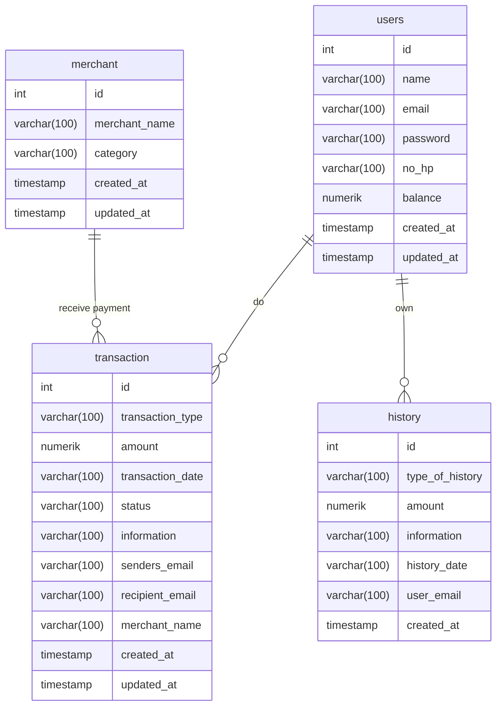

# ERD SISTEM E-WALLET
Gambaran untuk sistem aplikasi e-wallet

## PREVIEW

```mermaid
erDiagram

users{
    int id
    varchar(100) name
    varchar(100) email
    varchar(100) password
    varchar(100) no_hp
    numerik balance
    timestamp created_at
    timestamp updated_at
}


merchant {
    int id
    varchar(100) merchant_name
    varchar(100) category
    timestamp created_at
    timestamp updated_at
}

transaction {
    int id
    varchar(100) transaction_type    
    numerik amount
    varchar(100) transaction_date
    varchar(100) status              
    varchar(100) information
    varchar(100) senders_email    
    varchar(100) recipient_email    
    varchar(100) merchant_name 
    timestamp created_at
    timestamp updated_at     
}

history {
    int id
    varchar(100) type_of_history
    numerik amount
    varchar(100) information
    varchar(100) history_date
    varchar(100) user_email
    timestamp created_at
}

users ||--o{ transaction : "do"
users ||--o{ history : "own"
merchant ||--o{ transaction : "receive payment"

```