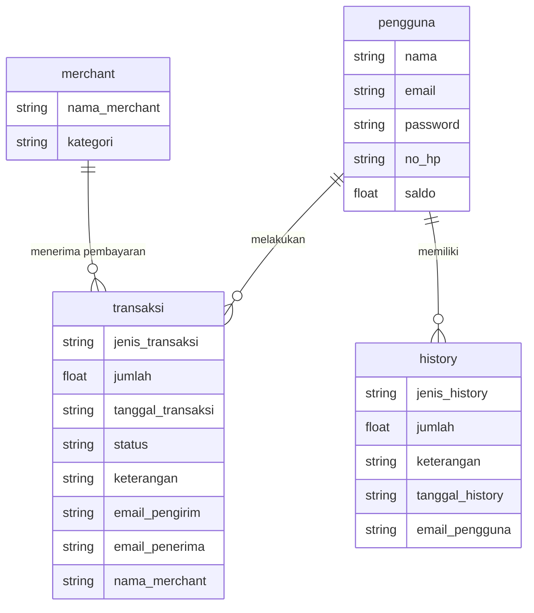

```mermaid
erDiagram

pengguna{
    string nama
    string email
    string password
    string no_hp
    float saldo
}


merchant {
    string nama_merchant
    string kategori
}

transaksi {
    string jenis_transaksi    
    float jumlah
    string tanggal_transaksi
    string status              
    string keterangan
    string email_pengirim      
    string email_penerima      
    string nama_merchant      
}

history {
    string jenis_history
    float jumlah
    string keterangan
    string tanggal_history
    string email_pengguna
}

pengguna ||--o{ transaksi : "melakukan"
pengguna ||--o{ history : "memiliki"
merchant ||--o{ transaksi : "menerima pembayaran"

```