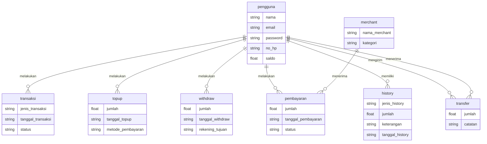

```mermaid
erDiagram

pengguna{
    string nama
    string email
    string password
    string no_hp
    float saldo
}

transaksi{
    string jenis_transaksi
    string tanggal_transaksi
    string status
}

topup{
    float jumlah
    string tanggal_topup
    string metode_pembayaran
}

withdraw{
    float jumlah
    string tanggal_withdraw
    string rekening_tujuan
}

merchant{
    string nama_merchant
    string kategori
}

pembayaran{
    float jumlah
    string tanggal_pembayaran
    string status
}

transfer{
    float jumlah
    string catatan
}

history{
    string jenis_history
    float jumlah
    string keterangan
    string tanggal_history
}

pengguna ||--o{ transaksi : "melakukan"
pengguna ||--o{ topup : "melakukan" 
pengguna ||--o{ withdraw : "melakukan"
pengguna ||--o{ pembayaran : "melakukan"
merchant ||--o{ pembayaran : "menerima"
pengguna ||--o{ history : "memiliki"
pengguna ||--o{ transfer : "mengirim"
pengguna ||--o{ transfer : "menerima"

```